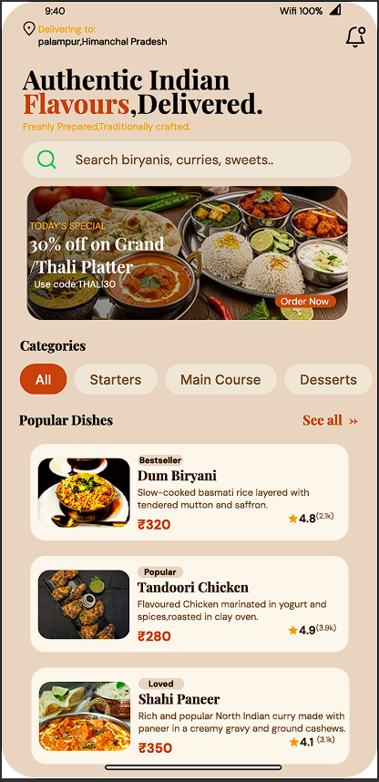
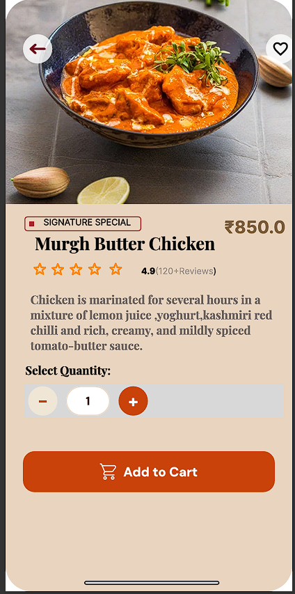
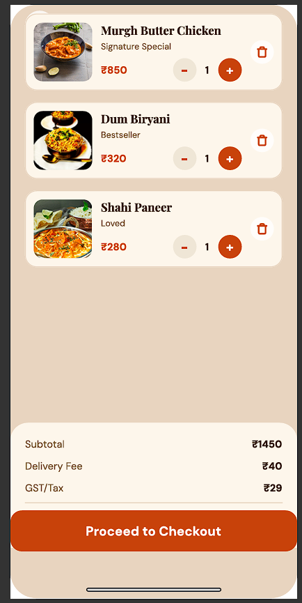
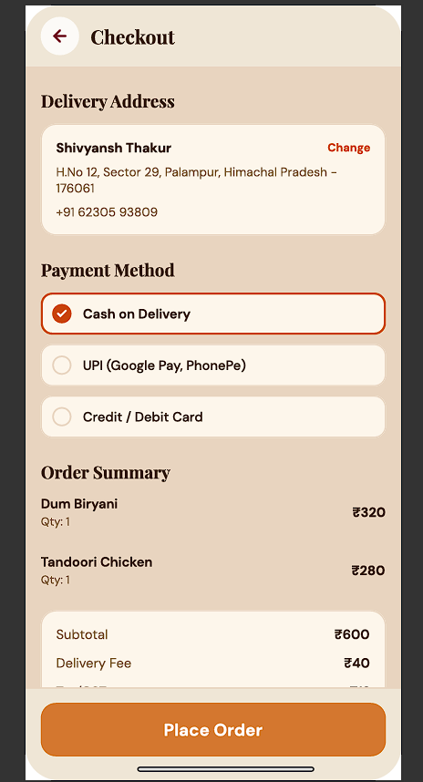
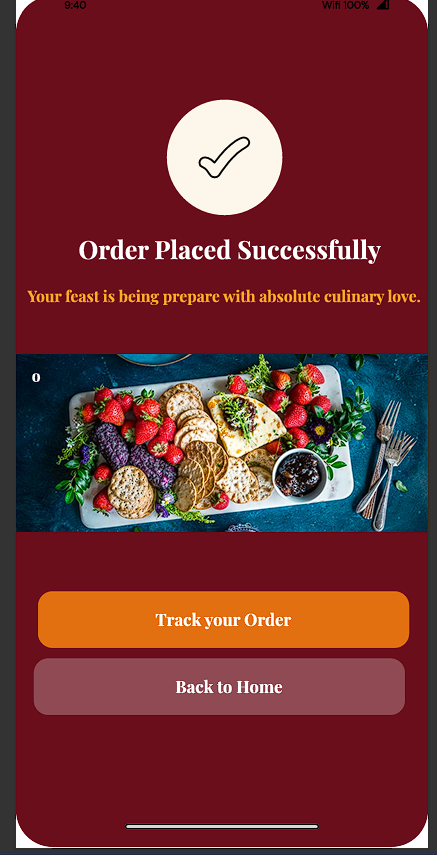

# 🍱 Authentic Indian Flavours — Food Delivery App UI/UX Case Study

A mobile-first UI/UX design case study for an authentic North Indian food delivery application. Built with a reusable component-driven design system in Figma and optimized for seamless developer handoff at a 375px viewport.

---

## 📌 Project Overview

* **Role:** UI/UX Designer & Product Architect
* **Tools Used:** Figma, Auto Layout, Component Variants
* **Target Viewport:** 375px (Mobile-First)
* **Design Standards:** WCAG 2.1 Accessibility (14px+ body font, 44×44px minimum tap targets)

---

## 🎨 User Flow & UI Screenshots

| 01. Home & Discovery | 02. Product Detail | 03. Cart View |
| :---: | :---: | :---: |
|  |  |  |
| *Search, Categories, Bestsellers* | *Murgh Butter Chicken Detail* | *Subtotal, Fees, Quantity Control* |

| 04. Checkout | 05. Order Confirmation |
| :---: | :---: |
|  |  |
| *Address Selection & Payment Methods* | *Order Tracking & Status* |

---

## 🛠️ Key UX Features & Design System

### 1. Discovery & Home Screen
* **Location Banner:** Clear delivery location header ("Palampur, Himachal Pradesh").
* **Promotional Banners:** High-converting promo cards (e.g., "30% off on Grand Thali Platter - Code: THALI30").
* **Category Filters:** Horizontal scrolling categories (Starters, Main Course, Desserts, Drinks).
* **Dish Cards:** Clear pricing, ratings, tag badges ("Bestseller", "Loved"), and single-tap add actions.

### 2. Item Detail Screen (Signature Special)
* **Rich Descriptions:** Highlighted dish preparation details for high-margin items (e.g., *Murgh Butter Chicken*).
* **Interactive Stepper:** Quantity increment/decrement controls.

### 3. Cart & Checkout Flow
* **Transparent Breakdown:** Detailed pricing breakdown including Item Subtotal, Delivery Fee, and GST/Taxes.
* **Payment Flexibility:** Multiple options including UPI (Google Pay, PhonePe), Cards, and Cash on Delivery.
* **Order Tracking Trigger:** Seamless transition from order placement to real-time order tracking.

---

## ♿ Accessibility Considerations (WCAG Guidance)

* **Contrast & Legibility:** Ensured high-contrast typography for light backgrounds (14px+ minimum body sizes).
* **Touch Targets:** Designed interactive buttons (Proceed to Checkout, Place Order) with a minimum height of 44px to prevent miss-clicks on mobile viewports.

---

## 🔗 Links & Resources

* 🎨 **Figma Design File:** [(https://www.figma.com/design/r4CGRVoJBw3FXZkvVmF3Fb/Food-App?node-id=0-1&t=iMrk7wpj7E8lzZdv-1)]
* 📄 **Design Presentation (PNG):** [View File](Food-App.png)

---

## 📜 License
Distributed under the MIT License. See `LICENSE` for more information.
